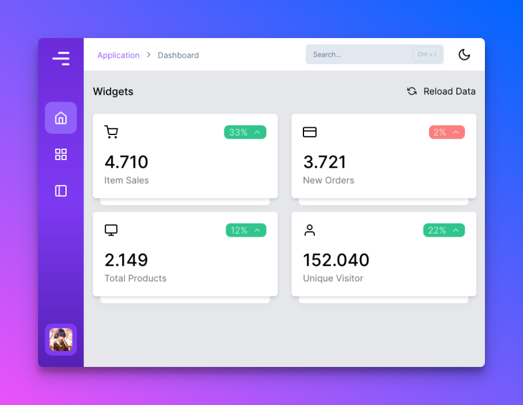

<h1 align="center">Ayuwind</h1>
<p align="center">Ayuwind is an Admin Dashboard Template that can help you develop faster. Made with Alpine and Tailwind.</p>

<p align="center">


[](https://github.com/ayuwind/ayuwind/issues)


</p>



## Installation

1. Clone this repository or download zip

```bash
git clone https://github.com/ayuwind/ayuwind
```

2. Open `ayuwind/dist/index.html` to see the dashboard

## Demo and Documentation

- Open the [demo page](https://ayuwind.vercel.app)
- Open the [documentation page](https://ayuwind.vercel.app)

## Contributing

- Fork it ( https://github.com/ayuwind/ayuwind/fork )
- Create your feature branch (`git checkout -b my-new-feature`)
- Commit your changes (`git commit -am 'Add some feature'`)
- Push to the branch (`git push origin my-new-feature`)
- Create a new Pull Request

### Note

- If you want to make some changes in the CSS style. Don't edit the `.css` file, use the SCSS file instead.
- Since we use Nunjucks, if you want to make changes to the HTML structure, make sure you change the source file (Nunjucks) located in `src`.

## License

Ayuwind is under MIT License.

## About the Author

Ayuwind is created by <a href="https://rizkhal.me">Rizkhal</a>